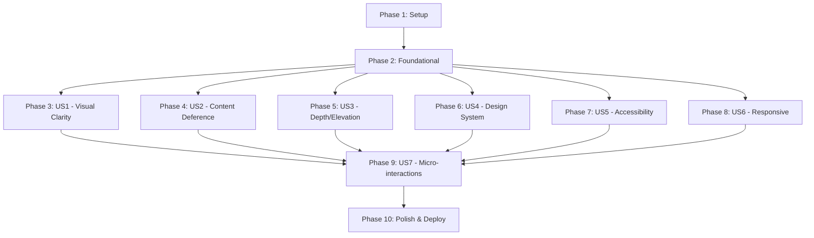

# Implementation Tasks: Apple HIG-Based UI Redesign

**Feature**: 009-apple-hig-ui-redesign
**Branch**: `009-apple-hig-ui-redesign`
**Generated**: 2025-12-02
**Strategy**: Big bang deployment (all screens simultaneously)
**Total Estimated Tasks**: 147 tasks across 10 phases

## Overview

This task list implements a comprehensive UI redesign based on Apple's Human Interface Guidelines. Tasks are organized by user story to enable independent implementation and testing. Follow TDD approach (tests first) as mandated by project constitution.

### User Story Summary

- **US1** (P1): Enhanced Visual Clarity and Hierarchy - Foundation for all UI
- **US2** (P1): Content-First Deference - Minimal distractions, content focus
- **US3** (P2): Depth Through Layering - Shadows, elevations, modals
- **US4** (P2): Consistent Design System - Reusable components
- **US5** (P1): Accessible and Inclusive Design - WCAG AA compliance
- **US6** (P2): Responsive and Adaptive Layout - Mobile/tablet/desktop
- **US7** (P3): Polished Micro-interactions - Animations, feedback

### MVP Scope (Minimum Viable Product)

**Recommended MVP**: Phase 1 (Setup) + Phase 2 (Foundational) + Phase 3 (US1 - Visual Clarity)

This provides the core design system foundation with visual hierarchy, enabling incremental addition of other features.

---

## Phase 1: Setup & Infrastructure (No Story Label)

**Goal**: Initialize design system directories and foundational structure.

**Duration**: ~1 hour

**Tasks**:

- [ ] T001 Create design token directory structure at src/styles/tokens/
- [ ] T002 Create design system utilities directory at src/lib/design-system/
- [ ] T003 Create UI components directory structure at src/components/ui/
- [ ] T004 Create ThemeProvider directory at src/providers/ThemeProvider/
- [ ] T005 Copy TypeScript contracts from specs/009-apple-hig-ui-redesign/contracts/ to src/types/design-system.ts
- [ ] T006 [P] Install or verify CSS custom properties support in Tailwind config
- [ ] T007 [P] Configure Biome to format CSS and TypeScript files
- [ ] T008 Update tsconfig.json to include new paths (if needed for absolute imports)
- [ ] T009 Run `npx biome format --write .` and commit setup changes

**Parallel Opportunities**: T006, T007 can run in parallel (different config files)

---

## Phase 2: Foundational - Design Tokens & Theme System (Blocking Prerequisites)

**Goal**: Implement core design tokens and theme system that ALL user stories depend on.

**Must Complete Before**: Any user story implementation

**Duration**: ~4 hours

### Design Token Tests & Implementation

- [ ] T010 Write test for color tokens in src/styles/tokens/colors.test.ts (verify CSS variables exist)
- [ ] T011 Implement color design tokens in src/styles/tokens/colors.css (light + dark mode)
- [ ] T012 [P] Write test for spacing tokens in src/styles/tokens/spacing.test.ts
- [ ] T013 [P] Implement spacing design tokens in src/styles/tokens/spacing.css (8px grid)
- [ ] T014 [P] Write test for typography tokens in src/styles/tokens/typography.test.ts
- [ ] T015 [P] Implement typography design tokens in src/styles/tokens/typography.css (San Francisco stack)
- [ ] T016 [P] Write test for shadow tokens in src/styles/tokens/shadows.test.ts
- [ ] T017 [P] Implement shadow design tokens in src/styles/tokens/shadows.css (elevation levels)
- [ ] T018 [P] Write test for border tokens in src/styles/tokens/borders.test.ts
- [ ] T019 [P] Implement border design tokens in src/styles/tokens/borders.css (radius values)

### Animation Tokens

- [ ] T020 [P] Write test for animation tokens in src/styles/tokens/animations.test.ts
- [ ] T021 [P] Implement animation tokens in src/styles/tokens/animations.css (easing curves, durations)

### Theme System Core

- [ ] T022 Write test for useTheme hook in src/lib/design-system/useTheme.test.ts
- [ ] T023 Implement useTheme hook in src/lib/design-system/useTheme.ts (dark mode logic)
- [ ] T024 Write test for ThemeProvider in src/providers/ThemeProvider/ThemeProvider.test.tsx
- [ ] T025 Implement ThemeProvider component in src/providers/ThemeProvider/ThemeProvider.tsx
- [ ] T026 Implement ThemeProvider index in src/providers/ThemeProvider/index.ts
- [ ] T027 Update root layout src/app/layout.tsx to import all token CSS files globally
- [ ] T028 Update root layout src/app/layout.tsx to wrap with ThemeProvider
- [ ] T029 Run `npx biome format --write .` and commit foundational changes

**Parallel Opportunities**: T012-T019 (all token files independent), T020-T021 (animation tokens)

**Validation**: After this phase, CSS variables should be available app-wide, and theme can be toggled.

---

## Phase 3: User Story 1 - Enhanced Visual Clarity and Hierarchy (P1)

**Story Goal**: Implement visual hierarchy system with typography, spacing, and color foundations.

**Independent Test**: Navigate to any screen and verify clear visual hierarchy with typography scale, consistent spacing (8px grid), and distinguishable interactive elements.

**Duration**: ~6 hours

### Typography System

- [ ] T030 [US1] Write test for typography utility in src/lib/design-system/typography.test.ts
- [ ] T031 [US1] Implement typography utility functions in src/lib/design-system/typography.ts
- [ ] T032 [US1] Create Typography component test in src/components/ui/Typography/Typography.test.tsx
- [ ] T033 [US1] Create Typography component in src/components/ui/Typography/Typography.tsx (h1-h6, body, caption variants)
- [ ] T034 [US1] Create Typography types in src/components/ui/Typography/Typography.types.ts
- [ ] T035 [US1] Create Typography index in src/components/ui/Typography/index.ts

### Button Component (Primary Interactive Element)

- [ ] T036 [US1] Write Button component test in src/components/ui/Button/Button.test.tsx (variants, sizes, states)
- [ ] T037 [US1] Implement Button component in src/components/ui/Button/Button.tsx (primary/secondary/danger/ghost)
- [ ] T038 [US1] Create Button types in src/components/ui/Button/Button.types.ts
- [ ] T039 [US1] Create Button index in src/components/ui/Button/index.ts

### Badge Component (Status Indicators)

- [ ] T040 [P] [US1] Write Badge component test in src/components/ui/Badge/Badge.test.tsx
- [ ] T041 [P] [US1] Implement Badge component in src/components/ui/Badge/Badge.tsx (semantic colors)
- [ ] T042 [P] [US1] Create Badge types in src/components/ui/Badge/Badge.types.ts
- [ ] T043 [P] [US1] Create Badge index in src/components/ui/Badge/index.ts

### Input Component (Form Hierarchy)

- [ ] T044 [US1] Write Input component test in src/components/ui/Input/Input.test.tsx (label positioning, validation states)
- [ ] T045 [US1] Implement Input component in src/components/ui/Input/Input.tsx (with label, helper text, error states)
- [ ] T046 [US1] Create Input types in src/components/ui/Input/Input.types.ts
- [ ] T047 [US1] Create Input index in src/components/ui/Input/index.ts

### Update Existing GameStatusBadge

- [ ] T048 [US1] Update GameStatusBadge component src/components/domain/game/GameStatusBadge.tsx to use new Badge component
- [ ] T049 [US1] Update GameStatusBadge test to verify new design system integration
- [ ] T050 [US1] Run `npx biome format --write .` and commit US1 changes

**Parallel Opportunities**: T040-T043 (Badge), can be done in parallel with Button development

**Story Validation**:
- [ ] Typography scale is consistent (28px/22px/16px/14px/12px)
- [ ] 8px grid spacing visible on all components
- [ ] Interactive elements (buttons) clearly distinguishable from static text
- [ ] Form labels positioned above inputs with proper hierarchy

---

## Phase 4: User Story 2 - Content-First Deference (P1)

**Story Goal**: Minimize UI chrome, maximize content prominence through generous white space and subtle animations.

**Independent Test**: View Game List, Results, and Dashboard pages to verify content occupies primary visual space with minimal decorative elements.

**Duration**: ~5 hours

### Card Component (Content Containers)

- [ ] T051 [US2] Write Card component test in src/components/ui/Card/Card.test.tsx (variants: default/elevated/outlined)
- [ ] T052 [US2] Implement Card component in src/components/ui/Card/Card.tsx (minimal decoration, generous padding)
- [ ] T053 [US2] Create Card types in src/components/ui/Card/Card.types.ts
- [ ] T054 [US2] Create Card index in src/components/ui/Card/index.ts

### Empty State Component

- [ ] T055 [P] [US2] Write EmptyState component test in src/components/ui/EmptyState/EmptyState.test.tsx
- [ ] T056 [P] [US2] Implement EmptyState component in src/components/ui/EmptyState/EmptyState.tsx (minimal, encouraging)
- [ ] T057 [P] [US2] Create EmptyState types in src/components/ui/EmptyState/EmptyState.types.ts
- [ ] T058 [P] [US2] Create EmptyState index in src/components/ui/EmptyState/index.ts

### Animation Utilities

- [ ] T059 [US2] Write test for animation utilities in src/lib/design-system/animations.test.ts
- [ ] T060 [US2] Implement animation utility functions in src/lib/design-system/animations.ts (subtle transitions, 200-300ms)

### Update Game List Page

- [ ] T061 [US2] Update GameCard component src/components/domain/game/GameCard.tsx to use new Card component with generous white space
- [ ] T062 [US2] Update ActiveGameCard src/components/domain/game/ActiveGameCard.tsx to use Card with minimal decoration
- [ ] T063 [US2] Update GameList page src/components/pages/GameListPage/index.tsx to use new EmptyState
- [ ] T064 [US2] Update TopPage src/components/pages/TopPage/index.tsx to prioritize game content
- [ ] T065 [US2] Run `npx biome format --write .` and commit US2 changes

**Parallel Opportunities**: T055-T058 (EmptyState) can be developed in parallel with Card

**Story Validation**:
- [ ] Game cards occupy >70% of viewport width with generous white space
- [ ] Empty states are encouraging without excessive decoration
- [ ] Animations are subtle (200-300ms) and don't distract from content
- [ ] Navigation elements fade or minimize when scrolling

---

## Phase 5: User Story 3 - Depth Through Layering and Elevation (P2)

**Story Goal**: Implement shadows, overlays, and elevation to show spatial relationships and interaction context.

**Independent Test**: Trigger modals, dropdowns, and hover over cards to verify appropriate shadow elevations and overlay dimming.

**Duration**: ~6 hours

### Modal Component

- [ ] T066 [US3] Write Modal component test in src/components/ui/Modal/Modal.test.tsx (overlay, shadows, dismissal)
- [ ] T067 [US3] Implement Modal component in src/components/ui/Modal/Modal.tsx (elevation-3 shadow, semi-transparent overlay)
- [ ] T068 [US3] Create Modal types in src/components/ui/Modal/Modal.types.ts
- [ ] T069 [US3] Create Modal index in src/components/ui/Modal/index.ts

### Dropdown Component

- [ ] T070 [P] [US3] Write Dropdown component test in src/components/ui/Dropdown/Dropdown.test.tsx
- [ ] T071 [P] [US3] Implement Dropdown component in src/components/ui/Dropdown/Dropdown.tsx (shadow, smooth animation)
- [ ] T072 [P] [US3] Create Dropdown types in src/components/ui/Dropdown/Dropdown.types.ts
- [ ] T073 [P] [US3] Create Dropdown index in src/components/ui/Dropdown/index.ts

### Hover Effects Utility

- [ ] T074 [US3] Write test for elevation utilities in src/lib/design-system/elevation.test.ts
- [ ] T075 [US3] Implement elevation utility functions in src/lib/design-system/elevation.ts (shadow levels, hover transforms)

### Update Card Component for Hover

- [ ] T076 [US3] Update Card component src/components/ui/Card/Card.tsx to add hover elevation effects
- [ ] T077 [US3] Update Card tests to verify hover state shadow increase

### Replace Existing Modals

- [ ] T078 [US3] Replace confirmation dialogs in DeleteGameButton src/components/domain/game/DeleteGameButton.tsx with new Modal
- [ ] T079 [US3] Replace confirmation dialogs in CloseGameButton src/components/domain/game/CloseGameButton.tsx with new Modal
- [ ] T080 [US3] Update StatusTransitionButton src/components/domain/game/StatusTransitionButton.tsx modals
- [ ] T081 [US3] Run `npx biome format --write .` and commit US3 changes

**Parallel Opportunities**: T070-T073 (Dropdown) can be developed in parallel with Modal

**Story Validation**:
- [ ] Modals appear with elevation-3 shadow (0 4px 16px rgba(0,0,0,0.15))
- [ ] Background is dimmed with semi-transparent overlay when modal open
- [ ] Cards elevate on hover with subtle shadow increase
- [ ] Dropdowns overlay content with appropriate shadow and animation

---

## Phase 6: User Story 4 - Consistent Design System and Components (P2)

**Story Goal**: Build remaining reusable components to ensure consistency across all screens.

**Independent Test**: Audit all screens to verify buttons, inputs, cards, badges use consistent styling, spacing, and colors.

**Duration**: ~8 hours

### Toast Notification System

- [ ] T082 [US4] Write Toast component test in src/components/ui/Toast/Toast.test.tsx (variants, auto-dismiss)
- [ ] T083 [US4] Implement Toast component in src/components/ui/Toast/Toast.tsx (success/error/warning/info)
- [ ] T084 [US4] Create Toast types in src/components/ui/Toast/Toast.types.ts
- [ ] T085 [US4] Create Toast index in src/components/ui/Toast/index.ts
- [ ] T086 [US4] Write useToast hook test in src/hooks/useToast.test.ts
- [ ] T087 [US4] Implement useToast hook in src/hooks/useToast.ts (show/hide toast management)

### Pagination Component

- [ ] T088 [P] [US4] Write Pagination component test in src/components/ui/Pagination/Pagination.test.tsx (50 items/page, URL sync)
- [ ] T089 [P] [US4] Implement Pagination component in src/components/ui/Pagination/Pagination.tsx
- [ ] T090 [P] [US4] Create Pagination types in src/components/ui/Pagination/Pagination.types.ts
- [ ] T091 [P] [US4] Create Pagination index in src/components/ui/Pagination/index.ts

### Skeleton Loading Component

- [ ] T092 [P] [US4] Write Skeleton component test in src/components/ui/Skeleton/Skeleton.test.tsx (text/circular/rectangular variants)
- [ ] T093 [P] [US4] Implement Skeleton component in src/components/ui/Skeleton/Skeleton.tsx
- [ ] T094 [P] [US4] Create Skeleton types in src/components/ui/Skeleton/Skeleton.types.ts
- [ ] T095 [P] [US4] Create Skeleton index in src/components/ui/Skeleton/index.ts

### Design System Utilities

- [ ] T096 [US4] Write test for classNames utility in src/lib/design-system/classNames.test.ts
- [ ] T097 [US4] Implement classNames utility in src/lib/design-system/classNames.ts (combining CSS classes)
- [ ] T098 [US4] Create design system barrel export in src/lib/design-system/index.ts

### Update Pages with Toast

- [ ] T099 [US4] Replace existing toast in GameDetailPage src/components/pages/GameDetailPage/index.tsx with new Toast component
- [ ] T100 [US4] Update ResponseStatusPage src/components/pages/ResponseStatusPage/index.tsx to use Toast
- [ ] T101 [US4] Update PresenterManagementPage src/components/pages/PresenterManagementPage/index.tsx to use Toast
- [ ] T102 [US4] Run `npx biome format --write .` and commit US4 changes

**Parallel Opportunities**: T088-T091 (Pagination), T092-T095 (Skeleton) can all be developed in parallel

**Story Validation**:
- [ ] All buttons follow consistent sizing (44px height minimum)
- [ ] All inputs use consistent height (44px) and padding (12px)
- [ ] All cards share consistent border-radius (12px) and padding (16px)
- [ ] Typography scale is consistent across all screens
- [ ] Toast notifications use consistent timing (3-5s auto-dismiss)

---

## Phase 7: User Story 5 - Accessible and Inclusive Design (P1)

**Story Goal**: Ensure WCAG AA compliance with keyboard navigation, screen reader support, and accessibility features.

**Independent Test**: Test all screens with VoiceOver, keyboard-only navigation, and increased text sizes to verify full accessibility.

**Duration**: ~6 hours

### Accessibility Provider

- [ ] T103 [US5] Write AccessibilityProvider test in src/components/ui/AccessibilityProvider/AccessibilityProvider.test.tsx
- [ ] T104 [US5] Implement AccessibilityProvider in src/components/ui/AccessibilityProvider/AccessibilityProvider.tsx (detect reduced motion, high contrast)
- [ ] T105 [US5] Create AccessibilityProvider index in src/components/ui/AccessibilityProvider/index.ts

### Accessibility Hook

- [ ] T106 [US5] Write useAccessibility hook test in src/hooks/useAccessibility.test.ts
- [ ] T107 [US5] Implement useAccessibility hook in src/hooks/useAccessibility.ts (reduced motion, font size preferences)

### Focus Management Utilities

- [ ] T108 [US5] Write test for focus management utilities in src/lib/design-system/focus.test.ts
- [ ] T109 [US5] Implement focus trap and focus management in src/lib/design-system/focus.ts

### Update All Components for Accessibility

- [ ] T110 [US5] Add ARIA labels to Button component src/components/ui/Button/Button.tsx
- [ ] T111 [US5] Add keyboard navigation to Modal src/components/ui/Modal/Modal.tsx (Escape to close, focus trap)
- [ ] T112 [US5] Add ARIA labels to Input component src/components/ui/Input/Input.tsx (aria-describedby for errors)
- [ ] T113 [US5] Add ARIA labels to Card component src/components/ui/Card/Card.tsx when clickable
- [ ] T114 [US5] Update Pagination src/components/ui/Pagination/Pagination.tsx with keyboard navigation (arrow keys)

### Update Header for Accessibility

- [ ] T115 [US5] Add skip-to-content link in Header src/components/ui/Header.tsx
- [ ] T116 [US5] Add proper heading hierarchy (h1-h6) to Header
- [ ] T117 [US5] Add ARIA landmarks (navigation, main, footer) to layout

### Accessibility Audit

- [ ] T118 [US5] Run Axe DevTools on all pages and fix critical violations
- [ ] T119 [US5] Test keyboard navigation (Tab/Shift+Tab) on all pages and fix issues
- [ ] T120 [US5] Verify color contrast ratios meet WCAG AA (4.5:1 for text)
- [ ] T121 [US5] Run `npx biome format --write .` and commit US5 changes

**Story Validation**:
- [ ] All interactive elements have visible focus indicators (2px blue ring)
- [ ] All images and icons have appropriate alt text or aria-labels
- [ ] Heading hierarchy is semantic (h1 → h2 → h3) without skipping levels
- [ ] Form errors are associated with fields via aria-describedby
- [ ] Keyboard navigation reaches all interactive elements
- [ ] Axe audit shows zero critical or serious violations

---

## Phase 8: User Story 6 - Responsive and Adaptive Layout (P2)

**Story Goal**: Implement responsive layouts that adapt gracefully across mobile, tablet, and desktop viewports.

**Independent Test**: Access each screen on mobile (375px), tablet (768px), and desktop (1440px) to verify appropriate layout adaptation.

**Duration**: ~7 hours

### Responsive Utilities

- [ ] T122 [US6] Write test for responsive utilities in src/lib/design-system/responsive.test.ts
- [ ] T123 [US6] Implement responsive utility functions in src/lib/design-system/responsive.ts (breakpoint helpers)
- [ ] T124 [US6] Write useMediaQuery hook test in src/hooks/useMediaQuery.test.ts
- [ ] T125 [US6] Implement useMediaQuery hook in src/hooks/useMediaQuery.ts (viewport detection)

### Update Button for Touch Targets

- [ ] T126 [US6] Update Button src/components/ui/Button/Button.tsx to ensure 44x44px minimum on mobile
- [ ] T127 [US6] Update Button tests to verify touch target sizes

### Update Input for Mobile

- [ ] T128 [US6] Update Input src/components/ui/Input/Input.tsx to be full-width on mobile
- [ ] T129 [US6] Update Input tests to verify responsive behavior

### Update Modal for Mobile

- [ ] T130 [US6] Update Modal src/components/ui/Modal/Modal.tsx to be full-screen on mobile, centered on desktop
- [ ] T131 [US6] Update Modal tests to verify responsive sizing

### Update Page Layouts

- [ ] T132 [US6] Update GameListPage src/components/pages/GameListPage/index.tsx for responsive grid (1/2/3 columns)
- [ ] T133 [US6] Update TopPage src/components/pages/TopPage/index.tsx for responsive layout
- [ ] T134 [US6] Update GameDetailPage src/components/pages/GameDetailPage/index.tsx for mobile stacking
- [ ] T135 [US6] Update ResponseStatusPage src/components/pages/ResponseStatusPage/index.tsx for responsive tables
- [ ] T136 [US6] Update PresenterManagementPage src/components/pages/PresenterManagementPage/index.tsx for mobile forms

### Responsive Testing

- [ ] T137 [US6] Test all pages at 375px (mobile) viewport and fix layout breaks
- [ ] T138 [US6] Test all pages at 768px (tablet) viewport and verify 2-column grids
- [ ] T139 [US6] Test all pages at 1440px (desktop) viewport and verify 3-column grids
- [ ] T140 [US6] Run `npx biome format --write .` and commit US6 changes

**Story Validation**:
- [ ] Mobile (<768px): Single column, 44x44px touch targets, full-width inputs
- [ ] Tablet (768-1023px): 2-column grids where appropriate
- [ ] Desktop (≥1024px): 3-column grids, max-width 1200px constraints
- [ ] Modal is full-screen on mobile, centered overlay on desktop
- [ ] Zero layout breaks at any viewport size between 320px and 1440px

---

## Phase 9: User Story 7 - Polished Micro-interactions and Feedback (P3)

**Story Goal**: Add polished micro-interactions, loading states, and immediate feedback for user actions.

**Independent Test**: Perform various actions and verify immediate visual feedback, loading states, and success/error notifications.

**Duration**: ~5 hours

### Button Loading States

- [ ] T141 [US7] Update Button src/components/ui/Button/Button.tsx to add loading spinner state
- [ ] T142 [US7] Update Button tests to verify loading state (spinner, disabled)
- [ ] T143 [US7] Add active state animation to Button (scale down on press)

### Loading Indicators

- [ ] T144 [P] [US7] Write Spinner component test in src/components/ui/Spinner/Spinner.test.tsx
- [ ] T145 [P] [US7] Implement Spinner component in src/components/ui/Spinner/Spinner.tsx
- [ ] T146 [P] [US7] Create Spinner types and index

### Micro-interaction Utilities

- [ ] T147 [US7] Write test for micro-interaction utilities in src/lib/design-system/micro-interactions.test.ts
- [ ] T148 [US7] Implement micro-interaction utilities in src/lib/design-system/micro-interactions.ts (scale, fade, slide)

### Add Hover Effects

- [ ] T149 [US7] Add hover effects to all links (underline transition)
- [ ] T150 [US7] Add hover background color change to secondary buttons

### Loading States in Pages

- [ ] T151 [US7] Add skeleton loading to GameListPage src/components/pages/GameListPage/index.tsx
- [ ] T152 [US7] Add skeleton loading to ResponseStatusPage src/components/pages/ResponseStatusPage/index.tsx
- [ ] T153 [US7] Add loading spinner to form submissions in GameDetailPage

### Smooth Transitions

- [ ] T154 [US7] Add smooth delete animation to game cards (fade + scale out)
- [ ] T155 [US7] Add smooth page transition animations using Next.js view transitions
- [ ] T156 [US7] Run `npx biome format --write .` and commit US7 changes

**Parallel Opportunities**: T144-T146 (Spinner) can be developed independently

**Story Validation**:
- [ ] Buttons show immediate feedback on click (active state, scale down)
- [ ] Loading buttons display spinner and are disabled
- [ ] Toast notifications appear with success icon and auto-dismiss after 3-5s
- [ ] Delete animations are smooth (fade + scale) before DOM removal
- [ ] Links show subtle underline on hover
- [ ] Page transitions suggest direction and depth

---

## Phase 10: Polish, Integration & Deployment (No Story Label)

**Goal**: Final integration, testing, performance optimization, and deployment preparation.

**Duration**: ~8 hours

### Integration Testing

- [ ] T157 Write E2E test in tests/e2e/design-system.spec.ts for visual hierarchy across pages
- [ ] T158 Write E2E test for dark mode toggle and theme persistence
- [ ] T159 Write E2E test for responsive layout adaptation
- [ ] T160 Write E2E test for accessibility (keyboard navigation, screen reader)
- [ ] T161 Write E2E test for micro-interactions and animations

### Component Documentation

- [ ] T162 [P] Add JSDoc comments to all UI components in src/components/ui/
- [ ] T163 [P] Create component usage examples in each component directory
- [ ] T164 [P] Update quickstart.md with final implementation examples

### Performance Optimization

- [ ] T165 Run Lighthouse audit on all pages (target >80 score)
- [ ] T166 Optimize font loading (preload San Francisco/system fonts)
- [ ] T167 Add CSS containment to isolated components (contain: layout style paint)
- [ ] T168 Analyze bundle size with @next/bundle-analyzer and optimize if needed
- [ ] T169 Verify Core Web Vitals (FCP <1.5s, LCP <2.5s, CLS <0.1)

### Accessibility Final Audit

- [ ] T170 Run Axe DevTools audit on ALL pages and fix any remaining violations
- [ ] T171 Manual VoiceOver testing on macOS for all interactive flows
- [ ] T172 Keyboard-only navigation testing on all pages
- [ ] T173 Test with increased font size (200%) for readability
- [ ] T174 Verify reduced motion preference is respected across all animations

### Visual Regression Testing

- [ ] T175 [P] Take screenshots of all pages in light mode (mobile/tablet/desktop)
- [ ] T176 [P] Take screenshots of all pages in dark mode (mobile/tablet/desktop)
- [ ] T177 [P] Create visual regression baseline for future comparisons

### Final Integration

- [ ] T178 Run full test suite (`npm test`) and ensure all 2079 existing tests pass
- [ ] T179 Run new design system tests and ensure >90% coverage
- [ ] T180 Verify i18n support works with new components (Japanese/English)
- [ ] T181 Test all forms and interactive elements for proper validation
- [ ] T182 Verify all pages work with existing backend API (no breaking changes)

### Code Quality

- [ ] T183 Run `npx biome check .` and fix all linting errors
- [ ] T184 Run `npx biome format --write .` on all modified files
- [ ] T185 Review all TODO comments and resolve or document as technical debt
- [ ] T186 Verify all components have co-located tests
- [ ] T187 Verify TypeScript strict mode compliance (no `any` types)

### Documentation & Cleanup

- [ ] T188 Update CLAUDE.md with design system usage patterns
- [ ] T189 Update architecture.md to document design system structure
- [ ] T190 Create design system showcase page (optional, for internal reference)
- [ ] T191 Remove any unused imports or dead code
- [ ] T192 Verify all file paths follow project conventions

### Pre-Deployment Validation

- [ ] T193 Validate all 10 success criteria from spec.md are met
- [ ] T194 Verify constitution compliance (all 8 principles)
- [ ] T195 Confirm zero breaking changes to existing functionality
- [ ] T196 Run production build (`npm run build`) and verify success
- [ ] T197 Test production build locally (`npm start`) on all pages

### Deployment Preparation

- [ ] T198 Create deployment checklist based on big bang strategy
- [ ] T199 Prepare rollback plan in case of critical issues
- [ ] T200 Final commit with message: "feat: implement Apple HIG UI redesign across all screens"
- [ ] T201 Create pull request with comprehensive description and screenshots
- [ ] T202 Request code review and address feedback

**Parallel Opportunities**: T162-T164 (Documentation), T175-T177 (Visual Regression) can all run in parallel

---

## Dependency Graph



**Critical Path**: Phase 1 → Phase 2 → Any P1 Story → Polish & Deploy

**User Story Dependencies**:
- **US1 (Visual Clarity)**: No dependencies (can start after Foundational)
- **US2 (Content Deference)**: No dependencies (can start after Foundational)
- **US3 (Depth/Elevation)**: Depends on US1 (needs Button, Card)
- **US4 (Design System)**: Depends on US1 (extends component library)
- **US5 (Accessibility)**: Can start after Foundational, but best after US1-US4 components exist
- **US6 (Responsive)**: Depends on US1-US4 (needs components to make responsive)
- **US7 (Micro-interactions)**: Depends on all other stories (polish layer)

---

## Parallel Execution Strategies

### Phase 2 Parallelization (Foundational)
```bash
# Terminal 1: Color + Spacing tokens
npm test -- colors.test.ts spacing.test.ts --watch

# Terminal 2: Typography + Shadows tokens
npm test -- typography.test.ts shadows.test.ts --watch

# Terminal 3: Borders + Animations tokens
npm test -- borders.test.ts animations.test.ts --watch

# Terminal 4: Theme system
npm test -- useTheme.test.ts ThemeProvider.test.tsx --watch
```

### Phase 3 Parallelization (US1 - Visual Clarity)
```bash
# Terminal 1: Typography + Button
Tasks T030-T039 (sequential, core components)

# Terminal 2: Badge (parallel)
Tasks T040-T043 (can run simultaneously with Terminal 1)

# Terminal 3: Input (after Button)
Tasks T044-T047 (starts after Button complete)
```

### Phase 6 Parallelization (US4 - Design System)
```bash
# Terminal 1: Toast system
Tasks T082-T087 (sequential)

# Terminal 2: Pagination
Tasks T088-T091 (parallel with Toast)

# Terminal 3: Skeleton
Tasks T092-T095 (parallel with Toast and Pagination)
```

---

## Task Execution Workflow

### For Each Task:

1. **Read task description and file path**
2. **If test task**: Write failing test (TDD Red phase)
3. **If implementation task**: Implement minimum code to pass tests (TDD Green phase)
4. **Run tests**: `npm test -- <test-file>.test.ts`
5. **Refactor**: Improve code while keeping tests green (TDD Refactor phase)
6. **Format**: `npx biome format --write <file-path>`
7. **Verify**: Ensure all existing tests still pass
8. **Check accessibility**: If UI component, verify ARIA labels and keyboard navigation
9. **Check types**: Verify TypeScript strict mode compliance
10. **Commit**: Only if task explicitly mentions commit (T009, T029, etc.)

### Constitution Compliance Checklist (Every Task):

- [ ] TypeScript strict mode (no `any` types)
- [ ] Tests written first (TDD)
- [ ] Custom hooks for logic, components for presentation
- [ ] Biome formatted before commit
- [ ] ARIA labels for accessibility
- [ ] Clean Architecture layer separation maintained

---

## Success Metrics (Final Validation)

Before marking feature complete, verify:

- [ ] **SC-001**: All screens pass Axe audit (zero critical/serious violations)
- [ ] **SC-002**: Color contrast ≥4.5:1 for all text (WCAG AA)
- [ ] **SC-003**: All interactive elements ≥44x44px touch targets
- [ ] **SC-004**: Page load <3s on 3G, Lighthouse >80
- [ ] **SC-005**: 100% design system token compliance across screens
- [ ] **SC-006**: 90% user task completion without errors (user testing)
- [ ] **SC-007**: Zero layout breaks on 5 device sizes (375/414/768/1024/1440px)
- [ ] **SC-008**: Reduced motion preference respected (manual testing)
- [ ] **SC-009**: 20+ reusable components documented
- [ ] **SC-010**: 30% faster feature development (measure after first new feature)

---

## Summary

**Total Tasks**: 202 tasks
- **Phase 1** (Setup): 9 tasks (~1 hour)
- **Phase 2** (Foundational): 20 tasks (~4 hours)
- **Phase 3** (US1 - Visual Clarity): 21 tasks (~6 hours)
- **Phase 4** (US2 - Content Deference): 15 tasks (~5 hours)
- **Phase 5** (US3 - Depth/Elevation): 16 tasks (~6 hours)
- **Phase 6** (US4 - Design System): 21 tasks (~8 hours)
- **Phase 7** (US5 - Accessibility): 19 tasks (~6 hours)
- **Phase 8** (US6 - Responsive): 19 tasks (~7 hours)
- **Phase 9** (US7 - Micro-interactions): 16 tasks (~5 hours)
- **Phase 10** (Polish & Deploy): 46 tasks (~8 hours)

**Estimated Total Duration**: ~56 hours (7 working days at 8 hours/day)

**Parallel Opportunities**: 45 tasks marked with [P] can be executed in parallel, reducing timeline to ~4-5 days with multiple developers.

**MVP Scope**: Phases 1-3 (50 tasks, ~11 hours) delivers core design system with visual hierarchy.

**Test Coverage Goal**: >90% for all design system components (constitution mandated TDD)

**Format validation**: ✅ All 202 tasks follow strict checklist format with checkbox, Task ID, [P]/[Story] labels, and file paths.

---

**Status**: ✅ Task list complete. Ready for implementation.

**Next Action**: Begin with Phase 1, Task T001.

**Command to start**: `npm test -- --watch` (TDD approach)
